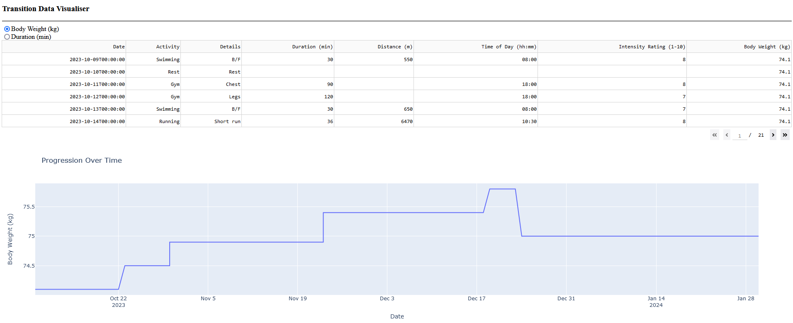

# Welcome to Transition: Your Ultimate Health & Fitness Companion

Are you ready to make a meaningful transition in your fitness journey? Transition is your all-in-one platform designed to help you track and improve your performance across various sports and exercise disciplines. It's time to take charge of your fitness goals and witness your remarkable transformation.

## What is Transition?

Transition is born out of the necessity to monitor and manage diverse sporting activities. Whether it's calisthenics, daily stretches, swimming, or weightlifting, Transition empowers you to keep a seamless record of your weekly exercise habits. While there are plenty of apps dedicated to specific sports, Transition stands out by providing a holistic approach to fitness tracking, allowing you to see trends and insights across all your activities.

## Key Features

- **Intuitive Graphical Interface:** Visualize your progress with easy-to-read graphs that showcase your journey over time.

- **Custom Workout Routines:** Create and manage personal workout routines tailored to your fitness goals. From calisthenics to preparing for your next triathlon, Transition has you covered.

- **Interactive Exercise Habit Tracking:** Stay engaged with your exercise data, making incremental improvements that lead to significant, long-lasting results.

## Getting Started

Ready to experience the power of Transition? Get started by [link to installation/setup instructions].

## Contributing

We welcome contributions from the fitness and tech community. If you have ideas, bug reports, or would like to contribute code, please [check out our contributing guidelines](link to contribution guidelines).

## Support

If you encounter any issues, have questions, or need assistance, feel free to [reach out to our support team](link to support contact).

## Stay Connected

Join the Transition community on [Twitter](link to Twitter profile), [Instagram](link to Instagram profile), and [Facebook](link to Facebook page) to stay updated on the latest news, tips, and success stories from our users.

Let's make your fitness journey extraordinary. Get started with Transition today!
